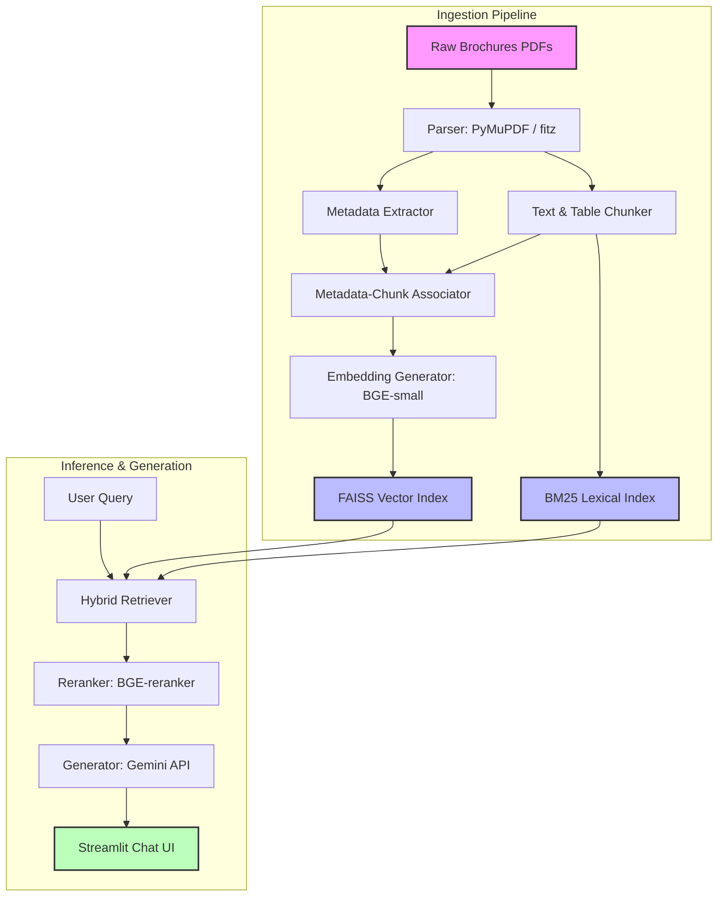

# DriveWise: Metadata-Aware Automotive RAG Assistant

DriveWise is a modular, production-ready Retrieval-Augmented Generation (RAG) assistant designed to answer user queries using official car brochure PDFs. It integrates dense semantic search, sparse lexical search, metadata filtering, cross-encoder reranking, and the Google Gemini API to deliver highly accurate and context-aware responses about vehicle configurations, specifications, performance, and features.

---

## Overview

Automotive brochures contain dense technical specifications, feature tables, and marketing literature that standard RAG systems often fail to retrieve accurately. DriveWise solves this by implementing:
1. **Metadata-Aware Ingestion**: Chunks are enriched with vehicle-specific tags (Brand, Model, Year, Section Category) to enable precise pre-filtering or post-filtering.
2. **Hybrid Retrieval**: Employs dense vector retrieval (via FAISS and BGE embeddings) alongside sparse lexical search (via BM25) to ensure both high semantic recall and technical precision.
3. **Cross-Encoder Reranking**: Re-orders the top retrieved passages using a dedicated reranker model before context feeding to maximize answer factualness and minimize hallucinations.
4. **Streamlit UI**: An intuitive, premium chat interface allowing users to filter by car metadata, trace sources, and view retrieved brochure pages.

---

## Planned Architecture

The diagram below represents the modular system flow of DriveWise:



---

## Folder Structure

```
DriveWise/
├── app/                  # User Interface components and layout views
│   ├── components.py     # Reusable Streamlit widgets (message bubbles, filters)
│   └── ui.py             # Main Streamlit view definitions
│
├── rag/                  # Core RAG pipeline module
│   ├── __init__.py       # Package initializer
│   ├── parser.py         # PDF text and table parser (PyMuPDF)
│   ├── chunker.py        # Text splitting & layout preservation strategies
│   ├── metadata.py       # Auto-extraction & tagging of car model metadata
│   ├── embeddings.py     # Interface for sentence-transformer vector generation
│   ├── vectorstore.py    # FAISS read/write/update operations
│   ├── retriever.py      # Hybrid retriever (Dense + Sparse with fusion)
│   ├── reranker.py       # Cross-encoder score optimization
│   ├── generator.py      # LLM response completion (Gemini API integration)
│   ├── logger.py         # Performance, latency, and cost tracing
│   ├── evaluator.py      # Automatic pipeline benchmarking (correctness & latency)
│   └── utils.py          # General directory and data formatting utility helpers
│
├── data/                 # Local data storage
│   ├── brochures/        # Sub-directories of car brochure PDFs grouped by manufacturer
│   ├── processed/        # Parsed text chunks, tables, and JSON metadata cache
│   ├── chunks/           # Structured section-aware chunk JSON files
│   ├── enriched/         # Chunk files enriched with metadata tags and keywords
│   └── cache/            # Model and API temporary caches
│
├── vectorstore/          # Serialized FAISS indices and vector databases
│   ├── index.faiss       # FAISS IndexFlatIP dense vector database
│   ├── bm25.pkl          # Serialized BM25 Okapi lexical index
│   └── metadata.json     # JSON metadata mapping matching vector/lexical indices
├── prompts/              # System and prompt template configuration files
│   └── system_prompt.txt # Prompt instructions guiding LLM generation constraints
├── logs/                 # Rotation application and performance log files
├── tests/                # Automated pytest unit and integration tests
│
├── config.py             # Global constants, file paths, and model configuration options
├── ingest.py             # Script to run raw brochure PDF ingestion and vector indexing
├── main.py               # Principal entrypoint to launch UI or CLI runner
├── requirements.txt      # Project Python package dependencies
├── .env.example          # Sample environment configuration template
├── .gitignore            # System, IDE, cache, and key file excludes
└── LICENSE               # MIT License file
```

---

## Features

- **Hybrid Dense-Sparse Search**: Merges vector space matches with exact word matching (BM25) for retrieving specs like "1.5L turbocharged engine".
- **Structured Metadata Filtering**: Scope your search to specific parameters like `Make: Hyundai`, `Year: 2024` or categories like `Safety`.
- **Factual Reranking**: Re-evaluates retrieval candidates with a Cross-Encoder to prioritize pages holding actual facts.
- **Failsafe Gemini Prompting**: Custom system prompt constraints that force the assistant to cite brochures or state "I do not know" instead of guessing.
- **Developer-Friendly Instrumentation**: Easy execution tracking, response time reporting, and automatic retrieval quality validation.

---

## Installation

### Prerequisites
- Python 3.9 or higher
- Streamlit and standard toolchain tools

### Step-by-Step Setup

1. **Clone the Repository**:
   ```bash
   git clone https://github.com/yourusername/DriveWise.git
   cd DriveWise
   ```

2. **Set up a Virtual Environment**:
   ```bash
   python -m venv .venv
   # On Windows:
   .venv\Scripts\activate
   # On macOS/Linux:
   source .venv/bin/activate
   ```

3. **Install Dependencies**:
   ```bash
   pip install -r requirements.txt
   ```

4. **Configure Environment Variables**:
   Copy `.env.example` to `.env` and fill in your Gemini API key:
   ```bash
   cp .env.example .env
   ```
   Add your API key inside `.env`:
   ```env
   GEMINI_API_KEY=your_gemini_api_key_here
   ```

5. **Incorporate Brochure Files**:
   Place brochure PDFs in `data/brochures/` nested within manufacturer directories:
   ```
   data/brochures/
   ├── Hyundai/
   ├── Kia/
   ├── Mahindra/
   └── Toyota/
   ```

6. **Run Ingestion Pipeline**:
   ```bash
   python ingest.py
   ```

7. **Launch the CLI Assistant**:
   ```bash
   python main.py
   ```

---

## License

This project is licensed under the MIT License - see the [LICENSE](LICENSE) file for details.
